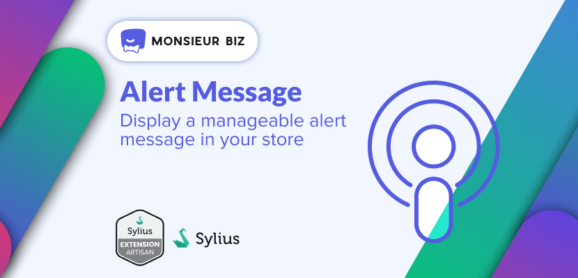
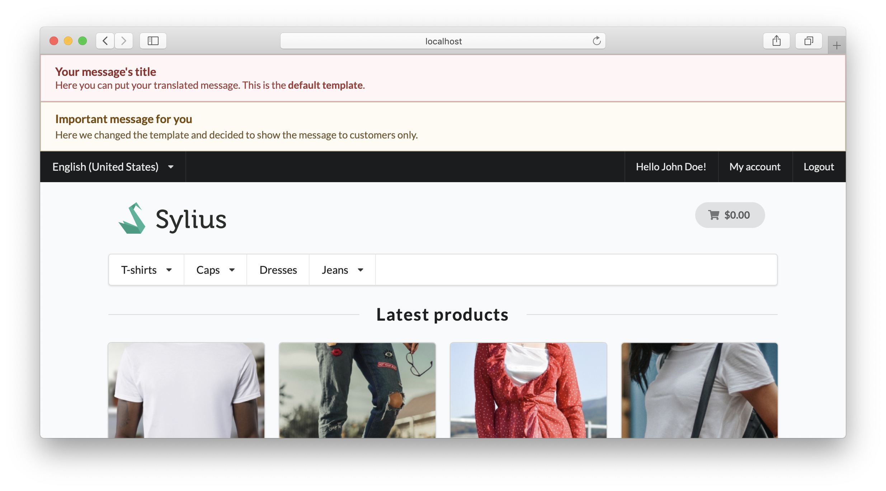

[](https://monsieurbiz.com/agence-web-experte-sylius)

<h1 align="center">Alert Message</h1>

[](https://github.com/monsieurbiz/SyliusAlertMessagePlugin/blob/master/LICENSE.txt)
[](https://github.com/monsieurbiz/SyliusAlertMessagePlugin/actions/workflows/tests.yaml)
[](https://github.com/monsieurbiz/SyliusAlertMessagePlugin/actions/workflows/security.yaml)
[](https://github.com/monsieurbiz/SyliusAlertMessagePlugin/actions/workflows/recipe.yaml)

This plugins allows you to add simple messages on your shop.  
The messages can be different for logged-in customers.

The message is displayed just after the opening `body`. You can change the HTML template directly in the admin panel.  
By default it'll use the Semantic UI classes.

 

## Installation

**Beware!**

> This installation instruction assumes that you're using Symfony Flex.

1. Require the plugin using composer

    ```bash
    composer require monsieurbiz/sylius-alert-message-plugin
    ```

2. Generate & Run Doctrine migrations

    ```
    ./bin/console doctrine:migration:diff
    ./bin/console doctrine:migration:migrate
    ```

## How it works

You just have to go in the Alert Messages section in your admin panel and add new message(s)!

## Examples

You could use this plugin to:

- Tell your customer how you are dealing with an epidemic outbreak.
- Make a legal announcement.
- Give all your logged-in customers a very attractive coupon code.

Being able to add a well seen message on your shop can be useful.

## Testing

See [TESTING.md](TESTING.md).

## Contributing

You can open an issue or a Pull Request if you want! 😘    
Thank you!
